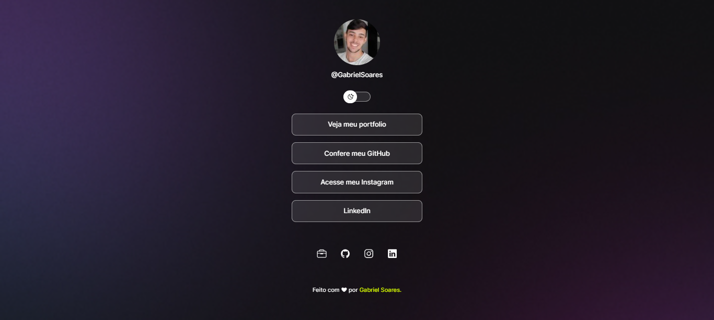

<h1 align="center"> Projeto - DevLinks </h1>

 

  

## 🚀 Tecnologias

Esse projeto foi desenvolvido com as seguintes tecnologias:

- HTML e CSS
- JavaScript
- Git e Github
- Figma

 

## 💻 Sobre

O DevLinks é um agregador de links para usar como cartão de visitas online. Projeto realizzado no bootcamp da Rocketseat.

---

 

Feito com ♥ by Rocketseat
